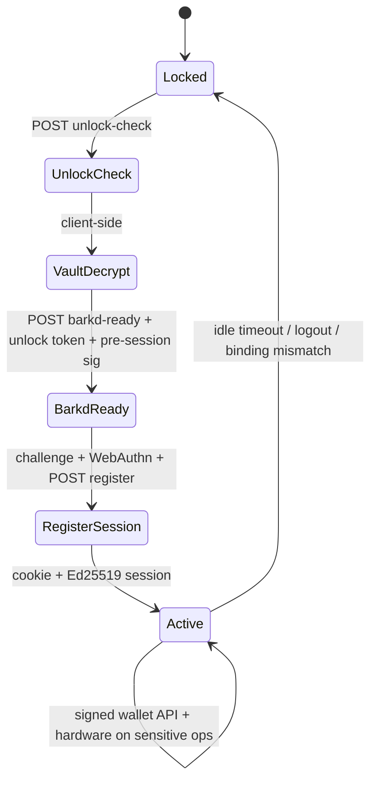
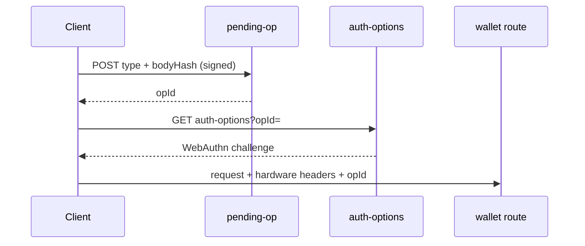
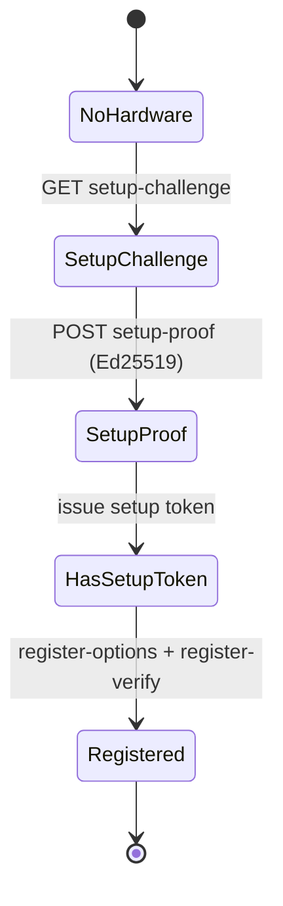

# Lean formal verification map (Ark Wallet)

This document maps the **ark-wallet** TypeScript codebase to a **Lean 4** verification plan. The goal is not to re-implement the app in Lean, but to model **security-relevant state machines and pure logic** and prove invariants that the TypeScript code is intended to satisfy.

**Baseline:** `main` after red-team passes through #17–#18 (barkd mode is the primary verification target; SDK mode is a separate trust model).

---

## 1. What “verify everything” means here

| Layer | In Lean? | Notes |
|-------|---------|--------|
| Pure crypto protocol (canonical bytes, nonce replay, TTL algebra) | **Yes** | Core of phase 1–2 |
| API authorization state machines (session, pending-op, setup token) | **Yes** | Abstract HTTP → transitions |
| Inbound policy (loopback, fetch-site, method allowlist) | **Yes** | Finite decision trees |
| Ed25519 / SHA-256 / AES-GCM correctness | **Axioms** | Use `Std` + crypto axioms or external facts |
| WebAuthn / FIDO2 | **Axioms + interface specs** | Model as oracle `VerifyAuthn` |
| barkd HTTP API / Bitcoin-Ark semantics | **Axioms** | Model as `Barkd` oracle |
| Next.js / React / browser / IndexedDB | **Out of scope** | Refinement links only |
| Malware on same machine / barkd `:3535` bypass | **Explicitly unproved** | Documented trust boundary |

**Honest target:** *refinement-style* guarantees — “if the runtime behaves like model `M`, these safety properties hold.”

---

## 2. Proposed Lean repository layout

```text
lean/
├── lakefile.lean
├── ArkWallet.lean                 -- import hub
├── Prelude/
│   ├── Bytes.lean                   -- byte strings, length, constant-time compare spec
│   ├── Time.lean                    -- Nat timestamps, skew window, TTL expiry
│   └── OptionResult.lean            -- unified errors (AuthDenied, Replay, Expired)
├── Crypto/
│   ├── Canonical.lean               -- canonicalRequest, hashBody, signingPath
│   ├── Ed25519.lean                 -- Sign/Verify (axiomatized)
│   ├── Nonce.lean                   -- UUID format, claim-once store
│   ├── Challenge.lean               -- issue / consume-once
│   └── EncryptedFile.lean           -- envelope v1 (axiom: GCM integrity)
├── Auth/
│   ├── Session.lean                 -- WalletSession, idle/TTL, touch, destroy
│   ├── SessionBinding.lean          -- client binding hash, mismatch → destroy
│   ├── PreSession.lean              -- verify without cookie
│   ├── UnlockToken.lean             -- issue, consume-once, binding
│   ├── PubkeyPin.lean               -- one pubkey per barkd fingerprint
│   └── SetupToken.lean              -- issue, validate, consume
├── WebAuthn/
│   ├── PendingOp.lean               -- opId, type, bodyHash, fingerprint, TTL
│   ├── HardwareFresh.lean           -- read-access window vs session TTL
│   └── AuthnOracle.lean             -- Register/Authenticate (axioms)
├── Inbound/
│   ├── Loopback.lean                -- Host/Origin predicates
│   ├── FetchSite.lean               -- Sec-Fetch-Site policy
│   └── ApiGate.lean                 -- composition → Allow | Deny
├── Routes/
│   ├── MiddlewareWallet.lean        -- /api/wallet/* cookie + header shape
│   ├── AuthFlows.lean               -- register, unlock, barkd-ready, logout
│   ├── WalletOps.lean               -- balance/history/send/refresh guards
│   └── SetupFlows.lean              -- setup-proof, register-options, auth-options
├── Refinement/
│   ├── TSIndex.lean                 -- names ↔ file paths (documentation)
│   └── Obligations.lean             -- list of sorries / axioms with owners
└── Tests/
    └── Examples.lean                -- `#eval` on small attack traces
```

Use **Lean 4** + `batteries` + `Std`. No existing `lean/` directory today — this is greenfield.

---

## 3. TypeScript → Lean module map

### 3.1 Cryptographic core (prove first)

| TypeScript | Lean module | Properties to prove |
|------------|-------------|---------------------|
| `src/lib/crypto/canonical.ts` | `Crypto.Canonical` | `canonicalRequest` deterministic; `signingPath` sorts query keys; `hashBody` independent of encoding |
| `src/lib/crypto/ed25519.ts` | `Crypto.Ed25519` | Axiom: verify(sign(m), m, pk) ↔ pk signed m |
| `src/lib/crypto/nonce-format.ts` | `Crypto.Nonce` | `isValidNonceUuid` ↔ RFC4122 v4 predicate |
| `src/lib/crypto/nonce-store.ts` | `Crypto.NonceStore` | `claimNonce` at-most-once per scope; persistence monotonic |
| `src/lib/crypto/challenges.ts` | `Crypto.Challenge` | `consumeChallenge` single-use |
| `src/lib/crypto/challenge-messages.ts` | `Crypto.Challenge` | Message domains disjoint (register / setup / session) |
| `src/lib/crypto/secure-compare.ts` | `Prelude.Bytes` | Constant-time equality spec (length leak ok to axiom) |
| `src/lib/crypto/pre-session.ts` | `Auth.PreSession` | Same verify pipeline as session without cookie |
| `src/lib/crypto/verify-request.ts` | `Auth.SessionVerify` | Replay + pubkey match + body hash + timestamp skew |
| `src/lib/crypto/session-store.ts` | `Auth.Session` | Idle ⊆ TTL; get after idle = none |
| `src/lib/client-binding.ts` | `Auth.SessionBinding` | Mismatch ⇒ destroy (no lazy bind) |

### 3.2 Tokens and pins

| TypeScript | Lean module | Properties |
|------------|-------------|------------|
| `src/lib/crypto/unlock-attempt-token.ts` | `Auth.UnlockToken` | Single consume; bound to `ClientBinding` |
| `src/lib/crypto/unlock-token-binding-store.ts` | `Auth.UnlockToken` | Expiry aligned with token TTL |
| `src/lib/crypto/setup-token.ts` | `Auth.SetupToken` | Validate vs consume; fingerprint + pubkey binding |
| `src/lib/crypto/pubkey-pin.ts` | `Auth.PubkeyPin` | At most one pubkey per fingerprint; `getFingerprintForPubkey` injective on pins |
| `src/lib/crypto/unlock-rate-limit.ts` | `Auth.UnlockBudget` | Budget monotonic per IP (abstract counter) |

### 3.3 WebAuthn / pending operations

| TypeScript | Lean module | Properties |
|------------|-------------|------------|
| `src/lib/webauthn/pending-op.ts` | `WebAuthn.PendingOp` | `matchesPendingOp` → `consumePendingOp` once; bodyHash binding |
| `src/lib/webauthn/pending-op-paths.ts` | `Routes.WalletOps` | Path → op type total function |
| `src/lib/webauthn/hardware-guard.ts` | `WebAuthn.HardwareFresh` | Read paths require fresh hardware or read-access op |
| `src/lib/webauthn/setup-proof.ts` | `Routes.SetupFlows` | Setup proof consumes challenge + nonce |
| `src/lib/webauthn/setup-gate.ts` | `Routes.SetupFlows` | Uniform error enum (no oracle branches) |
| `src/lib/webauthn/verify.ts` | `WebAuthn.AuthnOracle` | Axiom: server verification soundness |
| `src/sdk/webauthn/assertion-verify.ts` | `WebAuthn.SdkAuthn` | **Separate** model (client-only); not refinement of server |

### 3.4 Inbound security and middleware

| TypeScript | Lean module | Properties |
|------------|-------------|------------|
| `src/lib/security/loopback.ts` | `Inbound.Loopback` | Host/Origin acceptance closed world |
| `src/lib/inbound-security.ts` | `Inbound.ApiGate` | Composition order = implementation order |
| `src/middleware.ts` | `Routes.MiddlewareWallet` | `/api/wallet/*` requires header shape + valid session id |
| `src/lib/security/session-id.ts` | `Crypto.Nonce` | Session id uses same UUID predicate |
| `src/lib/ark-client.ts` | `Inbound.ApiGate` | `x-ark-client` exact match |

### 3.5 API routes (abstract state machines)

Each `src/app/api/**/route.ts` becomes a **transition** on global state `World`:

```lean
structure World where
  sessions    : SessionStore
  nonces      : NonceStore
  challenges  : ChallengeStore
  pendingOps  : PendingOpStore
  pins        : PubkeyPinStore
  unlockTok   : UnlockTokenStore
  setupTok    : SetupTokenStore
  webauthn    : WebAuthnStore
  barkd       : BarkdModel   -- abstract
```

| Route group | Lean | Main obligation |
|-------------|------|----------------|
| `auth/challenge`, `auth/register` | `AuthFlows.Register` | Challenge single-use; pin rules; cookie issued |
| `auth/unlock-check`, `unlock-failed`, `barkd-ready` | `AuthFlows.Unlock` | Token consume-once; barkd-ready policy (no wallet oracle) |
| `auth/logout` | `AuthFlows.Logout` | Session removed |
| `auth/webauthn/*` | `Routes.SetupFlows` + `WebAuthn` | Gates per red-team uniform errors |
| `wallet/balance`, `history`, `address` | `Routes.WalletOps.Read` | Session verify + hardware fresh |
| `wallet/send`, `send/estimate`, `refresh` | `Routes.WalletOps.Write` | Pending op + hardware + session verify |
| `wallet/sync` | `Routes.WalletOps.Sync` | No balance leak (response enum) |
| `health` | `Routes.Health` | Response only `{ok: daemon}` — no wallet bit |
| `wallet/ready` (GET) | `Routes.Deprecated` | Always 410 |

### 3.6 Persistence (optional phase 3)

| TypeScript | Lean | Note |
|------------|------|------|
| `src/lib/encrypted-file.ts` | `Crypto.EncryptedFile` | Axiom: decrypt(encrypt(s)) = s |
| `src/lib/persisted-scoped-store.ts` | Generic `PersistStore` | Load/save round-trip |
| `src/lib/security/retention-policy.ts` | `Auth.Retention` | TTL constants + purge preserves no-leak |

### 3.7 Explicitly excluded from full verification

| Area | Reason |
|------|--------|
| `src/store/*`, `src/components/*` | UI; link via test vectors only |
| `src/lib/barkd.ts` | External daemon; axiomatize interface |
| `src/sdk/**` | Different product mode (`ALLOW_SDK_IN_PRODUCTION`) |
| `packages/bark-ffi-bindings/**` | Third-party FFI |
| `instrumentation.ts`, `next.config.ts` | Deployment config |

---

## 4. End-to-end state machines (barkd mode)

### 4.1 Session lifecycle



**Lean theorems (examples):**

- `∀ w, replay_nonce(w) → false` after successful verify.
- `binding_mismatch(w) → session ∉ w.sessions`.
- `∀ read_op, Active → hardware_fresh ∨ read_access_op_valid`.

### 4.2 Pending operation pipeline



**Lean:** `opId` must exist in `pendingOps` at auth-options and at consume; fingerprint constant.

### 4.3 Setup / hardware registration



---

## 5. Security properties catalog (theorem checklist)

### P0 — Must prove (pure + state)

| ID | Statement |
|----|-----------|
| P0-1 | Nonce replay impossible per `(scope, nonce)` after claim |
| P0-2 | Challenge replay impossible after consume |
| P0-3 | `verifySignedRequest` implies `header_pk = session_pk` |
| P0-4 | Pending op consumed at most once per `opId` |
| P0-5 | Pending op `bodyHash` matches at verify time |
| P0-6 | Unlock token consumed at most once per token id |
| P0-7 | Setup token cannot be used after consume |
| P0-8 | Pubkey pin: at most one pubkey per fingerprint |
| P0-9 | Session destroyed on binding mismatch (no update) |
| P0-10 | Middleware rejects wallet routes without valid session headers |

### P1 — Inbound policy

| ID | Statement |
|----|-----------|
| P1-1 | Non-loopback Host ⇒ reject (modulo `ALLOW_REMOTE_HOST` flag in config) |
| P1-2 | Production mutations: `sec-fetch-site ≠ same-origin` ⇒ reject |
| P1-3 | Cross-site POST with `sec-fetch-site = cross-site` ⇒ reject |
| P1-4 | Read-protected GET: strict same-origin when strict mode |

### P2 — Oracle / uniformity (no information leak)

| ID | Statement |
|----|-----------|
| P2-1 | `register-options` without valid setup token ⇒ single error constructor |
| P2-2 | `auth-options` without valid pending op ⇒ single error constructor |
| P2-3 | `health` response independent of wallet file (axiom on `BarkdModel`) |
| P2-4 | `barkd-ready` before any pin: no `walletExists` in model transition |

### P3 — Liveness (optional, weaker)

| ID | Statement |
|----|-----------|
| P3-1 | Valid client can complete unlock if oracles OK (sketched, not critical) |

---

## 6. Axioms (trust boundaries)

```lean
/-- barkd holds funds; local processes may call :3535 -/
axiom BarkdBypass : ∀ (p : LocalProcess), CanSpend p

/-- Ed25519 signature soundness -/
axiom ed25519_verify_sign : ∀ (m : Message) (pk sk : Ed25519Key), ...

/-- Server WebAuthn verification -/
axiom webauthn_verify_auth : ∀ (resp : AuthResponse) (challenge : Challenge), ...

/-- Browser stores vault; malware may read after unlock -/
axiom ClientMemory : Type
```

Document each axiom in `SECURITY.md` cross-ref.

---

## 7. Refinement strategy (TypeScript ↔ Lean)

1. **Extract pure functions** — Already mostly pure in `src/lib/crypto/*`, `pending-op`, `inbound-security`.
2. **Executable test vectors** — Export JSON fixtures from Vitest (`tests/unit/*`) → Lean `Examples` prove `TS_result = Lean_result` on inputs.
3. **Route handlers** — Model as `Handler : World → Request → World × Response` (no IO).
4. **Sorries** — One sorry per axiom; no sorry in P0 theorems once model stable.

CI runs `tsx scripts/fv-extract.ts` then `lake build` (see `lean-fv` job).

---

## 8. Phased rollout

| Phase | Duration (est.) | Deliverable |
|-------|-----------------|-------------|
| **0** | 1 week | `lean/` skeleton + `Canonical` + `Nonce` + 20 test vectors |
| **1** | 2–3 weeks | `Session` + `verifySignedRequest` model + P0-1..P0-3 |
| **2** | 2 weeks | `PendingOp` + `HardwareFresh` + P0-4..P0-5 |
| **3** | 2 weeks | `UnlockToken` + `SetupToken` + `PubkeyPin` + unlock/register flows |
| **4** | 2 weeks | `Inbound.ApiGate` + middleware wallet gate |
| **5** | 2 weeks | Route-level `World` + P2 uniformity theorems |
| **6** | ongoing | SDK separate tree `ArkWallet.Sdk` |

**“Everything”** ≈ phases 0–5 for **barkd mode** core; UI/SDK/barkd semantics remain axiomatic.

---

## 9. Vitest tests as formal oracles

| Test file | Lean use |
|-----------|----------|
| `tests/unit/verify-request.test.ts` | Session verify regression |
| `tests/unit/pre-session.test.ts` | PreSession soundness |
| `tests/unit/webauthn-pending.test.ts` | PendingOp consume |
| `tests/unit/unlock-attempt-token.test.ts` | Unlock token |
| `tests/unit/challenges-setup.test.ts` | Challenge + setup proof |
| `tests/unit/barkd-ready.test.ts` | barkd-ready policy |
| `tests/unit/webauthn-setup-gate.test.ts` | Uniform errors |
| `tests/unit/webauthn-auth-gate.test.ts` | auth-options gate |
| `tests/unit/inbound-security.test.ts` | Fetch-site / loopback |
| `tests/unit/security-hardening.test.ts` | Session idle |

Generate fixtures: hash inputs/outputs of pure functions for `lake exe fv-sync`.

---

## 10. File inventory (security-critical)

**~45 TypeScript modules** merit modeling (under `src/lib/crypto`, `src/lib/webauthn`, `src/lib/inbound-security`, `src/middleware.ts`, `src/lib/api-guard*.ts`, `src/app/api/**`).

**~22 API routes** → 22 transition lemmas (can group by handler template).

**~30 unit test files** → refinement witnesses (not full proofs).

---

## 11. Next steps (implementation)

**Phases 0–4 (in progress):** see [lean/README.md](../lean/README.md).

| Phase | Status | Lean modules |
|-------|--------|----------------|
| 0 | Done | `Crypto/Canonical`, `Nonce`, `NonceStore`, `FvFixtures`, `Tests/Examples` |
| 1 | Done | `Auth/Session`, `SessionBinding`, `VerifyRequest`, `PreSession`, `Tests/Verify` |
| 2 | Done | `WebAuthn/PendingOp`, `PendingOpPaths`, `HardwareFresh`, `SetupGate` |
| 3 | Done | `Inbound/Loopback`, `Inbound/ApiGate`, `Tests/Inbound` |
| 4 | Partial | `World`, `Routes/RouteId`, `MiddlewareWallet`, `Health`, `Refinement/TSIndex` |
| 5 | Pending | Per-route `World` transitions for all 22 API handlers |
| 6 | Pending | SDK tree `ArkWallet.Sdk` |

1. ~~Add `lean/` with `lakefile.lean` and `Crypto/Canonical.lean`.~~
2. ~~Add `scripts/fv-extract.ts`.~~
3. Prove **P0-1** for arbitrary `NonceStore` (concrete traces only today).
4. Replace partial `hashBody` (fixture table) with full SHA-256 in Lean.
5. ~~Track axioms in `Refinement/Obligations.lean`.~~
6. Model each `route.ts` as `World → Request → World × Response`.
7. Keep SDK and barkd bypass separate.

---

## 12. Related docs

- [SECURITY.md](../SECURITY.md) — trust boundaries and controls list  
- [configuration.md](./configuration.md) — flags to model (`ALLOW_REMOTE_HOST`, `RELAX_FETCH_SITE`, retention)  
- [zero-trust-retention.md](./zero-trust-retention.md) — purge/TTL semantics  

For questions on Lean tooling: [Lean 4 manual](https://lean-lang.org/lean4/doc/), [Mathlib](https://leanprover-community.github.io/) for finite sets and lists used in stores.
